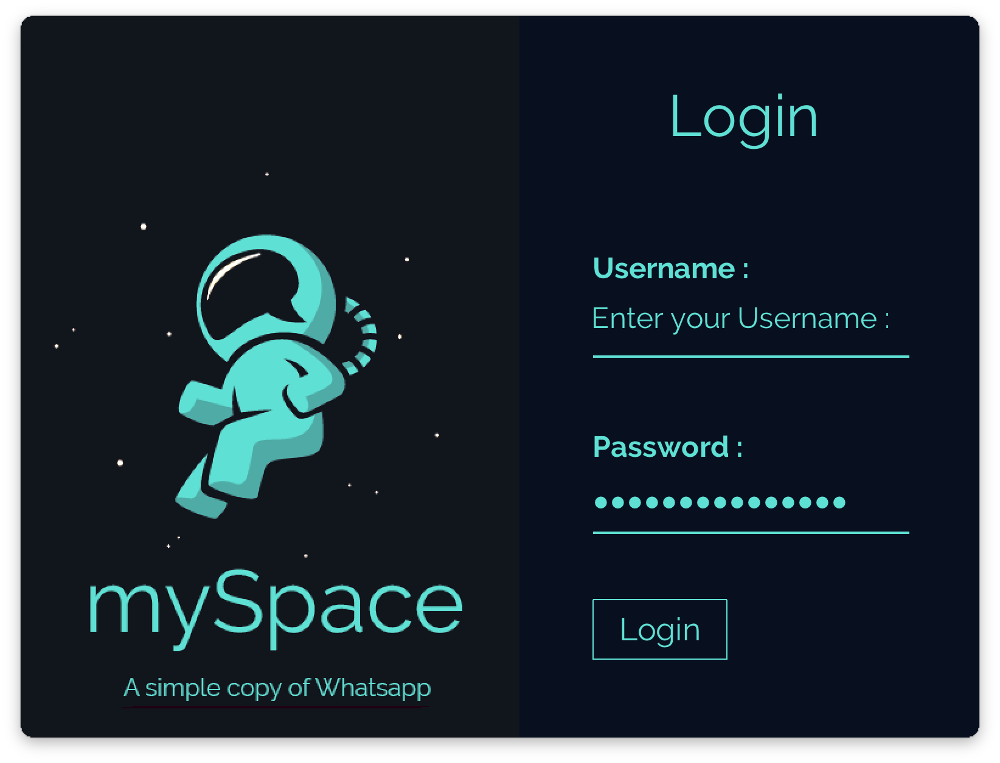

# Chat-Application

A client - server based chat application like whatsapp built on java.

##  How it works

- This application is built with the help of TCP/IP Proctocol. These protocols are used with the help of low-level-networking in java i.e with the help of Sockets. So basically if client A wants to send message to client B, since client A doesn't know the address of client B so it cannot send the message directly. Hence client A sends the message to the server who finds client B's IP address and  forwards the message.

## Functionalities

There are different functionalities provided by this application like.

##### 1) BACKUPS - 
It stores all the messages of each and every client at both server side and at the client side. The messages are stored at the server side for the purpose of backup & at the client side they are stored so that whenever the user closes the application the messages don't get deleted.

##### 2) MESSAGE STATUS - 
It also shows the message status that has been sent like whether the message has been sent or delivered or read by the user.

##### 3) USER STATUS - 
It also shows the users that are currently active at the moment.

##### 4) AUTHENTICATION - 
A login is also provided for the maintaing the security of the application.

## Screen Shots

***1 Login Page***

***Main Chat Page***

